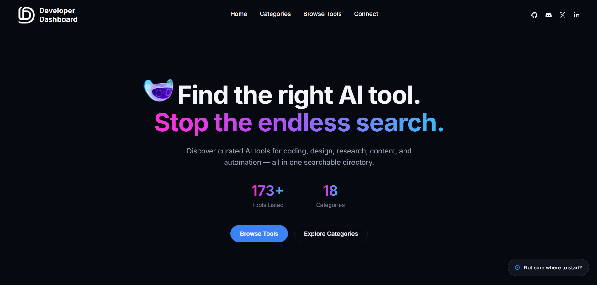

# 🤖 Developer Dashboard

> A curated directory of **150+ AI and developer tools** organized by category, pricing, and use case. Built with **Vanilla HTML, CSS, and JavaScript**, this project provides a fast, responsive, and dependency-free way to discover the best AI tools for development, productivity, research, design, automation, and more.

[](https://developer.mozilla.org/en-US/docs/Web/HTML)
[](https://developer.mozilla.org/en-US/docs/Web/CSS)
[](https://developer.mozilla.org/en-US/docs/Web/JavaScript)
[](#)
[](#)
[](#-license)

---

## 🌐 Live Demo

**🔗 Website:** [https://developer-dash-board.vercel.app/](https://developer-dash-board.vercel.app/)

---

## 📖 About the Project

The AI ecosystem is growing at an incredible pace, making it increasingly difficult to discover the right tools for a specific task. New AI products appear every week, and searching through countless websites often becomes time-consuming and overwhelming.

**Developer Dashboard** was created to solve this problem.

Rather than presenting an unorganized collection of AI websites, the dashboard categorizes carefully selected tools into structured sections such as Coding, Research, Writing, Design, Productivity, Automation, Business, Finance, Education, and many more.

The application is completely data-driven. Every tool is stored inside a single JSON file and dynamically rendered using Vanilla JavaScript, making the project highly maintainable, scalable, and easy to extend without modifying HTML.

The goal is to provide developers, students, creators, professionals, and businesses with a clean and efficient platform for discovering high-quality AI tools without wasting time comparing hundreds of alternatives.

---

# ✨ Features

- 🔍 Instant live search across 150+ AI tools
- 🏷️ Filter by Free, Paid, or All tools
- 🧭 Category-based navigation with active section highlighting
- ⚡ Dynamic rendering from a JSON database
- 🎨 Automatic favicon loading with initials fallback
- 📱 Fully responsive across desktop, tablet, and mobile devices
- 🚀 Zero frameworks or external UI libraries
- 📂 Easily extendable by editing a single JSON file
- 🌙 Modern dark UI with clean typography
- ⚙️ Lightweight and fast-loading architecture

---

# 🖼️ Preview



> Replace `./assets/preview.png` with an actual screenshot of the live site before pushing. A GIF of the search/filter in action works even better here.

---

# 🛠 Tech Stack

- HTML5
- CSS3
- JavaScript (ES6+)
- JSON
- Git
- GitHub Pages / Vercel

---

# 🏗 Project Architecture

```
Developer Dashboard
│
├── index.html
│   ├── Navbar
│   ├── Search Bar
│   ├── Pricing Filters
│   ├── Category Navigation
│   └── Dynamic Content Container
│
├── style.css
│   ├── Global Styles
│   ├── Responsive Layout
│   ├── Card Components
│   ├── Navigation
│   └── Dark Theme
│
├── app.js
│   ├── Fetch tools.json
│   ├── Render Tool Cards
│   ├── Search Functionality
│   ├── Pricing Filters
│   ├── Category Navigation
│   ├── Active Section Tracking
│   └── Favicon Fallback Handling
│
└── tools.json
    └── Complete AI Tool Database
```

---

# ⚙️ How It Works

1. The application loads `tools.json` when the page opens.
2. JavaScript groups every tool according to its category.
3. Tool cards are dynamically generated using template literals.
4. Search and pricing filters instantly re-render matching tools without reloading the page.
5. An `IntersectionObserver` tracks the currently visible category and highlights the corresponding navigation chip.
6. Favicons are automatically fetched from each website, with an initials-based fallback shown if loading fails.

---

# 📂 Project Structure

```
Developer_DashBoard/
│
├── index.html
├── style.css
├── app.js
├── tools.json
│
├── assets/
│   ├── icons/
│   ├── images/
│   └── preview.png
│
└── README.md
```

---

# 🚀 Getting Started

Clone the repository

```
git clone https://github.com/Atharva16bit/Developer_DashBoard.git
```

Navigate into the project

```
cd Developer_DashBoard
```

Run a local development server

```
python -m http.server
```

or

```
python3 -m http.server
```

Visit

```
http://localhost:8000
```

No installation, package manager, or build process is required.

---

# ➕ Adding a New Tool

Open `tools.json`.

Locate the appropriate category and append a new object.

```json
{
  "name": "Example AI Tool",
  "url": "https://example.com",
  "pricing": "free"
}
```

Save the file and refresh the browser.

The new tool is rendered automatically without editing any HTML.

---

# 💡 Technical Highlights

- Data-driven UI architecture
- Dynamic DOM rendering
- Fetch API
- Modular JSON dataset
- Vanilla JavaScript only
- Responsive CSS Grid
- Responsive Flexbox layouts
- Intersection Observer API
- Live search implementation
- Automatic favicon retrieval
- Error handling with graceful fallbacks
- Zero external dependencies

---

# 🧠 Skills Demonstrated

- HTML5
- CSS3
- JavaScript ES6+
- DOM Manipulation
- Fetch API
- JSON Data Modeling
- Responsive Web Design
- Component-Based UI
- Event Handling
- Search Algorithms
- Dynamic Rendering
- State Management
- Progressive Enhancement
- Git & GitHub

---

# 🚧 Challenges Solved

- Rendering a large collection of tools dynamically
- Maintaining a clean data-driven architecture
- Building fast client-side search
- Creating responsive layouts for all screen sizes
- Handling missing favicons gracefully
- Synchronizing category navigation with page scrolling
- Keeping the application lightweight without frameworks

---

# 🛣 Roadmap

- ⭐ Favorite tools
- 📋 Copy tool links
- 🏷️ Tags and advanced filtering
- 🌙 Light mode
- 🔄 Sort by popularity
- 📊 Tool ratings
- 🔍 Multi-filter search
- 📱 Progressive Web App (PWA)
- 🌐 API-powered tool updates
- 🤝 Community contributions

---

# ⚡ Performance

- No Frameworks
- No Build Tools
- No Package Manager
- Lightweight
- Fast Initial Load
- Static Website
- Easy Deployment
- GitHub Pages / Vercel Ready

---

# 📄 License

This project is licensed under the **MIT License**.

You are free to use, modify, and distribute this project under the terms of the MIT License.

---

# 👨‍💻 Author

**Atharva Patankar**

Second-Year B.Tech Computer Science Engineering Student focused on Full-Stack Development, AI Engineering, Cybersecurity, and Scalable Software Systems.

GitHub: [https://github.com/Atharva16bit](https://github.com/Atharva16bit)

---

## ⭐ Support

If you found this project useful, consider giving it a **⭐ Star** on GitHub.

It helps others discover the project and motivates future improvements.
